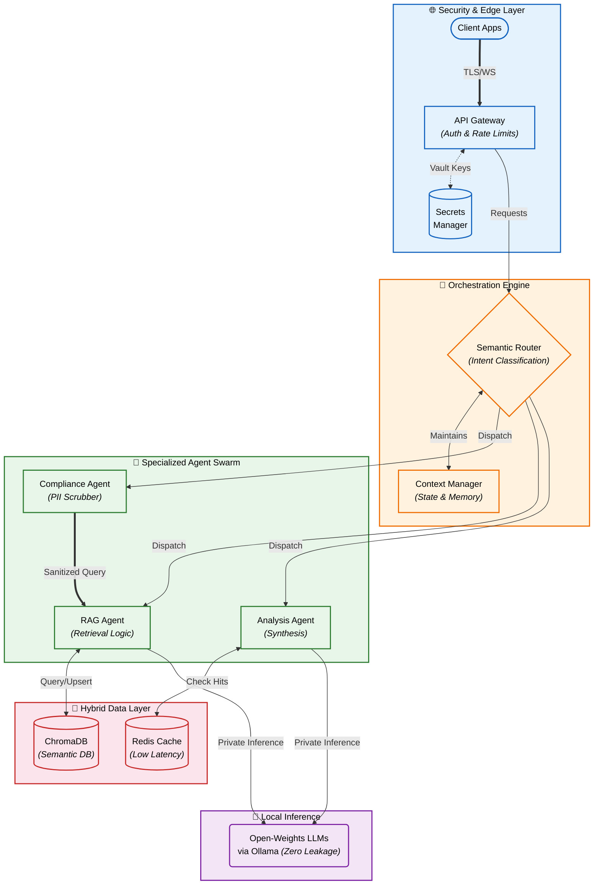

<div align="center">

# Guilherme Oliveira

**AI Engineer · Privacy-First RAG & Multi-Agent Systems · GDPR-Compliant Generative AI**

Building enterprise AI infrastructure that runs locally, scales globally, and leaks nothing.

[](https://www.linkedin.com/in/guilhermegors/)
[](mailto:guilhermegors@gmail.com)


</div>

---

### 🎯 What I Do & Impact

I engineer **Generative AI platforms for highly-regulated environments**, ensuring data privacy, scalable orchestration, and independence from cloud LLM providers. The market demands AI that respects GDPR — I build systems where **infrastructure sovereignty is the default**. 

Instead of just prototyping, I approach AI Engineering with a results-driven mindset:

*   **Sovereign Enterprise AI:** Companies need AI without risking proprietary data leaks. *Result:* Architected systems like **Codex One** and **IA News Agent**, utilizing open-weights models (Ollama) and on-prem ChromaDB to achieve **100% data sovereignty and zero external API dependencies**, making them audit-ready for strict compliance.
*   **Workflow Automation at Scale:** Manual data processing bottlenecks business growth. *Result:* Built **JobMatch**, a multi-agent RAG platform that parses unstructured resumes and performs semantic ranking, reducing human evaluation time by **95%** while retaining precise skill-matching.
*   **High-Throughput & Low-Latency AI:** Cloud API costs scale linearly; local inference requires optimization. *Result:* Implemented batch prompting, asynchronous LangGraph orchestration, and exact/semantic dual-layer caching (achieving **12ms inference latency** in Visual Tagger) to push CPU/GPU hardware to its limits.

```
Privacy-First RAG Pipelines    ·    Multi-Agent Orchestration    ·    Data Engineering (Spark + Scala)
Local LLM Deployment           ·    Multi-Cloud Infrastructure   ·    Security & GDPR Compliance
```

---

## ⚡ Featured Projects

<table>
<tr>
<td width="50%" valign="top">

### 📰 [IA News Agent](https://github.com/GuilhermeGors/IA_News)
**Autonomous multilingual intelligence pipeline**

Aggregates, enriches, and validates AI research across 10 languages and 7 source types. Uses a dual-model LLM strategy (Qwen 3B + 14B) driven by a stateful LangGraph reasoning core. Complete on-prem execution with zero data leakage.

`Python` `Ollama` `LangGraph` `ChromaDB` `FastAPI`

</td>
<td width="50%" valign="top">

### 🔒 [Codex One](https://github.com/GuilhermeGors/Codex_One)

**Privacy-first enterprise knowledge base — fully offline RAG**

Zero-egress architecture with pre-ingestion Threat Quarantine and automated PII Scrubbing. Uses CPU-bound ONNX embeddings and multilingual Cross-Encoder reranking (FlashRank) to isolate GPUs exclusively for Local LLMs (Ollama), delivering audit-ready compliance and high-performance retrieval.

`Python` `FastAPI` `Next.js` `Ollama` `ChromaDB` `FlashRank`

</td>
</tr>
<tr>
<td width="50%" valign="top">

### 🤖 [JobMatch](https://github.com/GuilhermeGors/JobMatch)
**Multi-agent RAG platform for HR automation**

Automated talent screening reducing manual evaluation by 95%. Semantic search over unstructured data, dynamic ranking, LLM-agnostic inference (OpenAI / Gemini / local). Real-time analytics via WebSockets.

`FastAPI` `LangChain` `React` `WebSockets` `Vector DB`

</td>
<td width="50%" valign="top">

### 🏷️ [Visual Tagger](https://github.com/GuilhermeGors/Visual_tagger)
**High-performance AI image classification — 12ms latency**

Concurrent ViT + CLIP Zero-Shot inference with confidence-score aggregation. Parallel model execution for automated multi-label tagging at production scale.

`FastAPI` `PyTorch` `HuggingFace` `CLIP` `Docker`

</td>
</tr>
<tr>
<td width="50%" valign="top">

### 💄 [Cosmetic Cosmos](https://github.com/GuilhermeGors/Cosmetic_cosmos)
**AI-augmented scalable sales management platform**

Distributed high-performance ScyllaDB backend handling concurrent retail transactions. Features an embedded role-aware local LLM assistant (Ollama) providing contextual KPIs and mentorship without exposing metrics to third parties.

`Node.js` `Express` `ScyllaDB` `Ollama` `Docker`

</td>
<td width="50%" valign="top">

### 🧱 [Systems Programming](https://github.com/GuilhermeGors/libft)
**Low-level engineering — C from scratch**

Custom standard library, Unix process pipelines, 2D rendering engine. Built at 42 São Paulo with zero external dependencies — raw memory management, file descriptors, and bitwise ops.

`C` `Unix` `Makefile` `Memory Management`

</td>
</tr>
</table>

---

## 🏗️ Architecture — How I Build RAG Systems



---

## 🛠️ Tech Stack

<table>
<tr>
<td align="center" width="25%">

**AI & ML**


</td>
<td align="center" width="25%">

**Data Engineering**


</td>
<td align="center" width="25%">

**Cloud & DevOps**


</td>
<td align="center" width="25%">

**Languages & APIs**


</td>
</tr>
</table>

---

## 📐 Core Engineering Core Principles

- **🔒 Privacy & Law by Design:** Engineered for environments where strict European GDPR dictates are mandatory. Implementing Offline LLMs and on-prem vector databases to guarantee zero third-party exposure.
- **🔌 Vendor-Agnostic Architecture:** Building decoupled, LLM-agnostic platforms. Codebases designed such that swapping OpenAI ↔ Gemini ↔ Local Ollama requires zero restructuring.
- **🚀 Scalability & Resiliency:** Designing hybrid architectures—from 200GB/day distributed Apache Spark systems to ultra-lightweight Dockerized microservices wrapped in circuit breakers and semantic cache layers.
- **⚙️ First-Principles Thinking:** Grounded in the brutal *42 São Paulo methodology* (C, Unix, memory management). I don't just glue APIs together; I profoundly understand the performance parameters executing them.

---

## 🎓 Background

**42 São Paulo** — Software Engineering *(Peer-to-peer, zero-professor model)*  
**Unisinos** — Analysis & Systems Development  
**Bayswater College, London** — Exchange Program  

🥈 **Moving The Cities** — Unisinos × SAP × FH Münster (Germany) × UAS7  
🏆 **Geração Caldeira** — First Class, Institute Caldeira  

---

<div align="center">

**Open solve problems**<br>
Fluent in English · Eligible anywhere :)

[](https://www.linkedin.com/in/guilhermegors/)
[](mailto:guilhermegors@gmail.com)

</div>

</details>
